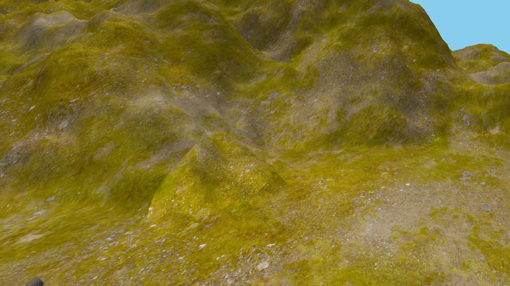

## OpenGL graphical app - City Animation 3D

## General description
- [ ] A desktop application written in C/C++
- [ ] OpenGL API used to achieve hardware-accelerated rendering
- [ ] Shaders written in GLSL (OpenGL Shading Language), executed on GPU
- [ ] GLFW library used to create an OpenGL context, define window parameters and handle user input
- [ ] Assimp library used to import model data into a scene object that contains all the data 

## Controls
Switching camera modes:
- [ ] <kbd>h</kbd> - stationary camera observing the scene
- [ ] <kbd>j</kbd> - camera following the moving car
- [ ] <kbd>k</kbd> - camera located on the moving car
- [ ] <kbd>l</kbd> - free camera - use <kbd>w</kbd><kbd>s</kbd><kbd>a</kbd><kbd>d</kbd> and mouse to change its position

Scroll to change field of view in any camera mode.

Switching shading modes:
- [ ] <kbd>i</kbd> - flat shading
- [ ] <kbd>o</kbd> - Gouraud shading
- [ ] <kbd>p</kbd> - Phong shading

Changing relative direction of reflectors on the car:
- [ ] <kbd>z</kbd> - move light to the left side
- [ ] <kbd>x</kbd> - reset reflectors' direction
- [ ] <kbd>c</kbd> - move light to the right side

Additional modes:
- [ ] <kbd>n</kbd> - day/night (day as default)
- [ ] <kbd>m</kbd> - on/off fog mode (off as default)

## Images

#### Reflectors on the moving car:

#### Point source of light:

#### Directional source of light:

#### Flat shading:

#### Gouraud shading:

#### Phong shading:

#### Fog effect:

## Short video
See 
